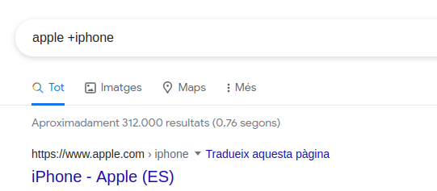

# UF2: Cercant informació

## Index de continguts

1. Comandes
2. Buscadors Comercials
3. Shodan
4. Exercicis
5. Bibliografia

## 1

## Comandes

● "" (cometes): buscar la frase exacte  
● __and__ or __not__ : operadors lògics “i” o “no”  
● __+__ i __-__ : incloure i excloure. Ex: "jaguar -cotxes": busca la paraula “jaguar”, pero omit les webs amb la paraula cotxes  
● __*__ (asterisc): comodí, qualsevol paraula, pero només una paraula  
● __.__ (punt): comodí, qualsevol paraula, una o moltes  
● __site__ : només busca resultats dintre de la web que va darrera de “site:”  
● __filetype__ : només busca arxius de un tipus (doc, xls, txt...)  
● __link__ : només busca en pàgines que tenen un link a una determinada url  
● __inanchor__ : només busca en pàgines que tenen en el text de enllaç la expresió cercada  
● __Allintext__ :text-> Aquest operador cerca una cadena en el text, dintre de una pàgina web, i no a la url. Es exclusiu.  
● __Allintitle__ :text → Cerca una cadena de text, només dintre del títol de la web. Es exclusiu.  
● __Intitle__ :text → Cerca una cadena de text dintre del títol de una web. Es inclusiu, es pot utilitzar amb altres.  
● __Allinurl__ :text → Cerca una cadena de text només en la url. Es exclusiu  
● __Inurl__ :text → Cerca una cadena de text en la url. Es inclusiu, es pot utilitzar amb altres.  
● __Author__ :text → Cerca artícles o noticies escrits pel nom o la direcció de correu indicada. Es inclusiu, es pot utilitzar amb altres.  
● __Cache__ :domini.com → Amb aquest operador accedim a la web que Google té guardada en la seva cache. Es util, si cerces informació que ha estat esborrada i Google no ha refrescat la caché. Es exclusiu.  
● __Link__ :domini.com Aquest operador es fa servir per buscar enllaços que apuntin a una web. Es exclusiu.  
● __Related__ :domini.com Busca paginas relacionadas. Es exclusiu.  

## 2

## Buscadors comercials (Bing/Google/DuckduckGo)

No tots els operadors estàn implementats a tots els cercadors

[Bing](https://www.bing.com) | [Google](https://www.google.com) | [DuckDuckGo](https://duckduckgo.com/)


**Operadors de cerca**

**Buscant por IPs.**

La comanda IP ens mostrarà resultats de webs que hi siguin allotjades en ella. La idea
de la comanda IP es bona, i crida l'atenció que bing la implementi, i google no, quan
te a veure amb el buscador Shodan que veurem després. Només cal posar una direcció IP
i apareixen llocs que hi son en ella.
```
ip: 192.168.1.12
```

**Buscant per localizació**

Per buscar pàginas localitzades en IPs relativas a un país. Per aixó s'han de fer
servir els codis internacionals de cada pais.
```
loc:es
```

**Buscant en una web**

Permet buscar termes en zones específiques de la web.

__site__  
__intitle__  
__inbody__  
__inanchor__  
__hasfeed__ : Búsca webs amb un feed RSS o atom que tingui el terme de cerca.

Es poden barrejar amb altres operadors lògics.

**Buscant per tipus de fitxer**

● __Filetype__ : Realmente busca sobre el tipo de fichero, así, un fichero .do que
devuelve un pdf ¿qué filetype tiene? -> La respuesta, segun Bing es que es un
filetype PDF.

## 3

## [Shodan](https://www.shodan.io/)

Shodan es un buscador diferent, permet buscar per tipus de dispositiu, per
localització, i un munt d'opcions més.

__country__ : per cercar en un pais especific. country:py  
__city__ : Filtra per ciutat. city:”Los Angeles”  
__port__ : Per cercar dispositius que tinguin un port especific obert. port:3306  
__net__ : Cerca de una ip específica o rangs de ip. ip:182.93.44.0/24  
__hostname__ : Cerca el text que indiquem en el nom del host. hostname:iplocal  
__geo__ : Cercar dispositius mitjançant coordenades. geo:32.9775,-70.1293  
__os__ : Per llistar un sistema operativo determinado. os:Linux  
__after__ : Dispositius afegits després de una data.  
__before__ : Dispositius afegits abans de una data. after/before:27/03/2015  
__has_screenshot__ : Mostra dispositius dels quals hi ha captura de pantalla. has_screenshot:true  

## 4

## Exercicis

### Google

**1.1 Explica per a que serveix cada una de les següents paraules clau. Posa un exemple
i mostra el primer resultat.**

● Allintext:  Serveix per localitzar pàgines web amb el terme de cerca al seu text. Exemple: allintext:seat ibiza.  


● Allintitle:  Serveix per trobar pàgines web amb el terme de cerca que aparegui al títol del text. Exemple: allintitle:pol moreno    


● Intitle:  Cerca pàgines amb certes paraules al títol. Exemple: intitle:manzana  


● Allinurl:  Només es retornaran els resultats que continguin totes les paraules especificades a l'URL. Exemple: allinurl:apple iphone  


● Inurl:  Cerca pàgines amb una paraula determinada a l'URL. Exemple: inurl:patata  


● Author:  Cerca autors. Exemple: author:dali  


● Cache:  Retorna la versió emmagatzemada a la memòria cache més recent d'una pàgina web. Exemple: cache:wikipedia.com  


● Link:  Cerca pàgines que enllacen amb el domini. Exemple: link:apple.com  


● Related:  Troba dominis similars al domini consultat. Exemple: related:apple.com  


● filetype:  Retorna només fitxers d'un tipus determinat associat la paraula clau cercada. Exemple: filetype:pdf  


● OR:  Cerqueu X o Y. Això tornarà resultats relacionats amb X o Y, o ambdós. Exemple: patata OR zanahoria  


● AND:  Cerqueu X i Y. Això només retornarà resultats relacionats amb X i Y. Exemple: plata AND plomo   


● |:  El mateix que OR. Exemple: patata|zanahoria  


● -:  Exclou una paraula dels resultats. Exemple: apple -iphone   


● +:  Força una cerca de concordança exacta en una sola paraula o frase. Exemple: apple +iphone  


**1.2. Fés una cerca per a fitxers pdf dintre de dominis .edu.**  
  
  
### Bing

**2.1 Explica per a que serveix cada una de les següents paraules clau. Posa un exemple
i mostra el primer resultat**

● ip:  Busca per IP. Exemple: ip:192.168.1.1


● loc:  Busca la localització de país: Exemple: loc:es


● site:  Busca la pagina web. Exemple: site:polmorenobatlle.com


● intitle:  Busca el contingut al titol de la pagina web. Exemple: intitle:pol moreno


● inbody:  Busca que la paraula o frase estigui al body de la pagina web. Exemple: inbody:barcelona


● inanchor:  Busca que la paraula estigui a l'adreça url. Exemple: inanchor:castell


● hasfeed:  Busca pàgines que enllaçen amb feeds que contenen la paraula clau especificada. Exemple: hasfeed:cyber attacks


● Filetype:  Busca segons el tipus de fitcher que es demani. Exemple: filetype:pdf


● Inurl:  Busca que la paraula clau estigui a l'url. Exemple: inurl:noticia


**2.2. ¿Què podem trobar entre google i bing, tant a l'hora de la cerca com a l'hora de
indexar?**  

**2.3. Agafa algunes de las anterios recercas de google i comparalas amb bing(número de
resultats, puc veure els mateixos resultats? similars?**  

### Duckduckgo

**3.1. Agafa les anteriors cerques i comparar-les amb duckduckgo.**  

**3.2. Investiga com fer una cerca en altres buscadors des de duckduckgo.**  

### Shodan

**3.1 Explica per a que serveix cada una de les següents paraules clau. Posa un exemple
i mostra el primer resultat**

● country: per cercar en un pais especific. Exemple: country:py

● city: Filtra per ciutat. Exemple: city:”Los Angeles”

● port: Per cercar dispositius que tinguin un port especific obert. Exemple: port:3306

● net: Cerca de una ip específica o rangs de ip. Exemple: ip:182.93.44.0/24

● hostname: Cerca el text que indiquem en el nom del host. Exemple: hostname:iplocal

● geo: Cercar dispositius mitjançant coordenades. Exemple: geo:32.9775,-70.1293

● os: Per llistar un sistema operativo determinado. Exemple: os:Linux

● after: Dispositius afegits després de una data.

● before: Dispositius afegits abans de una data. Exemple: after/before:27/03/2015

● has_screenshot: Mostra dispositius dels quals hi ha captura de pantalla. Exemple: has_screenshot:true  
 

