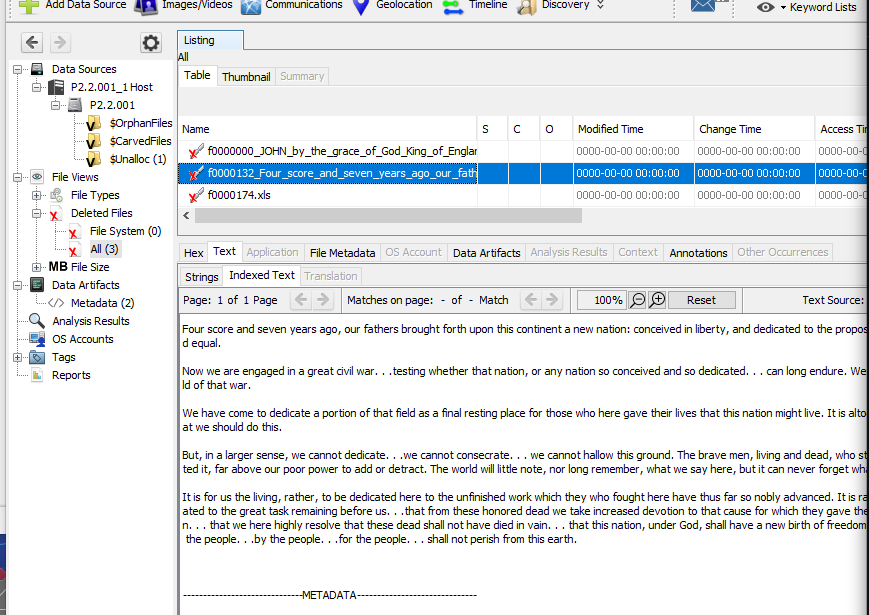
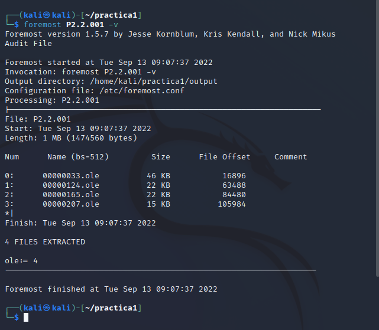
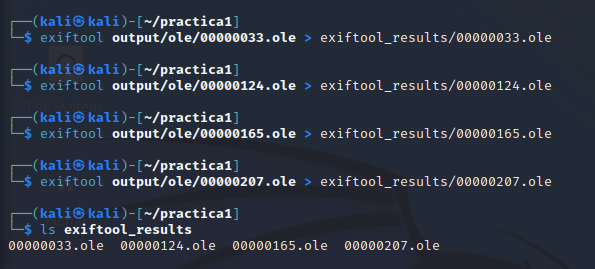
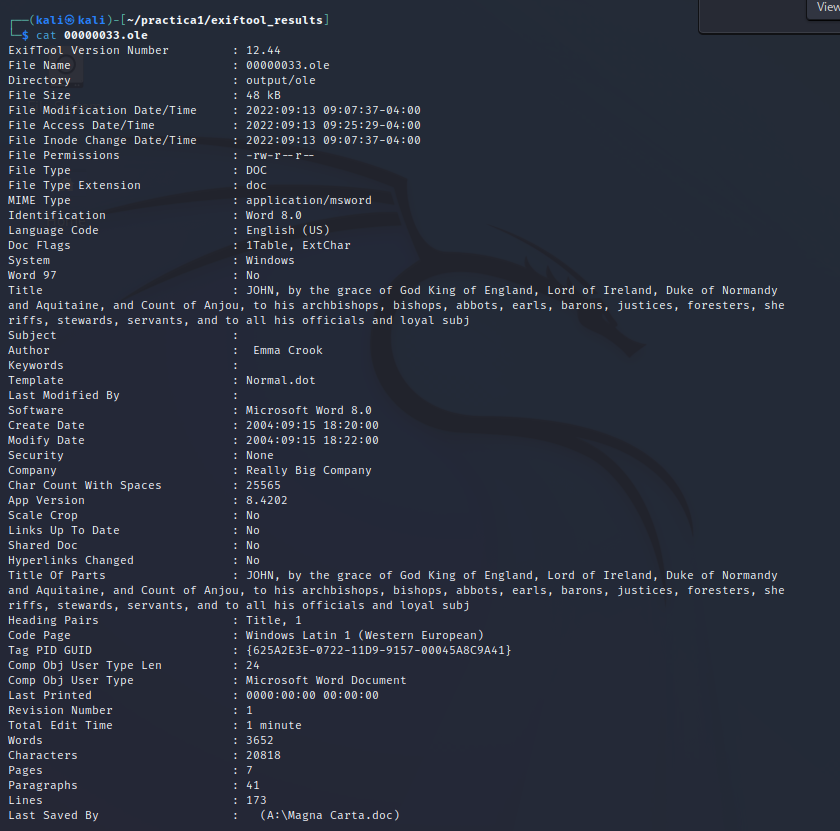
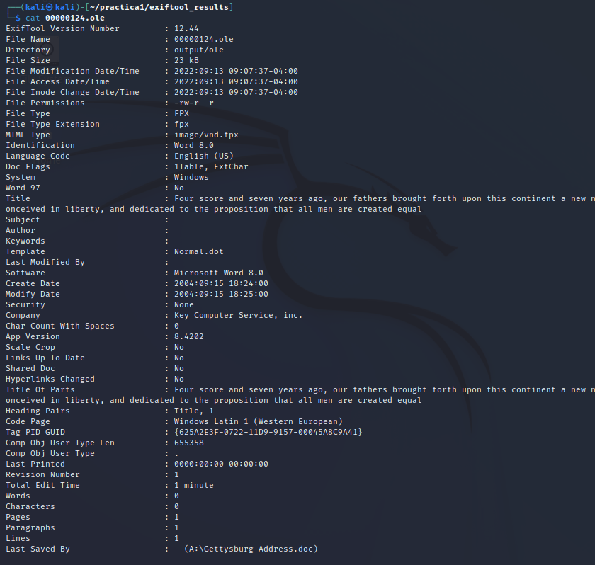
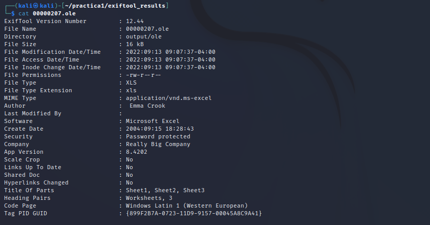
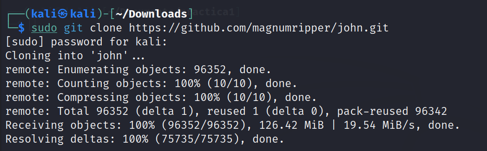
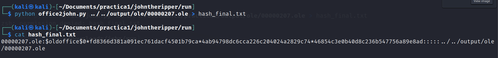
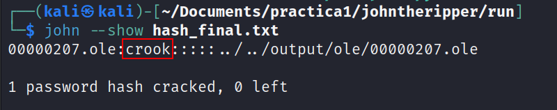
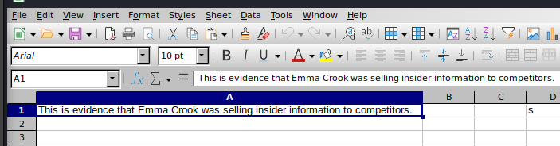

# Pràctica 1 - Anàlisi forense I

## 1

## Introducció

#### Eines  
```
Kali Linux  
Testdisk (command line)  
Foremost (Command line)  
Forensics/Autopsy (Windows && JDK)  
```

#### Lliureu un document en format PDF amb els passos que heu seguit i la resposta a les preguntes que es plantejen


## 11

## Escenari


#### Avui és 15 de setembre de 2004. L'hora són les 3:15 PM. El senyor Jim Boss, el propietari de la Really Big Company, et truca per a què vagis a la seva oficina. El senyor Boss et comenta que sospita que la seva assistent, Emma Crook, estava proporcionant material sensible de l'empresa a alguns dels seus competidors. A les 2:00 PM, avui truca a la Sra Crook i li comenta les seves sospites. Li diu que tornaria a les 3:00 PM per a una explicació. Quan el senyor Boss torna a l'oficina de la Sra. Crook a les 3:00 PM, ella no hi és, i ha buidat el despatx de totes les seves pertinences. El senyor Boss intenta encendre l'ordinador de la senyora Crook, però no arrenca. Examinant l’habitació, troba un disquet a la paperera. El senyor Boss t’entrega el disquet i vol que li expliquis exactament el que la Sra. Crook estava fent. El primer que fas es comprovar l’ordinador, i trobes que li falta el disc dur. Així doncs, l’única prova que tenim és un disquet. Un cop ja al teu despatx, introdueixes el disquet i descobreixes que no hi ha res, és a dir, l’han formatejat.  

#### Fas una còpia del mateix i obtens un fitxer [RAW](./RAWs/P2.2.001) amb el què treballaràs.  

```1. Documenta i descriu tot el procés de la teva investigació (amb captures de pantalla, comentant tots els passos seguits).```


## 12

## Anàlisi amb Autopsy

```○ Forensics / autopsy → per a analitzar la imatge RAW```

#### Des de una màquina windows, baixa i instal·la l'[Autopsy](https://www.autopsy.com/)
#### Amb aquest programa, carrega la imatge RAW anterior, i analitzala.

Executem l'autopsy sobre l'arxiu RAW i trobem el seguent:  




```
● ¿Que trobes?  
Veiem que als "Deleted Files" hi ha 3 arxius, dos Microsoft Word i un Microsoft Excel.

● ¿Pots llegir alguna informació? En cas afirmatiu, ¿Quina?  
Podem llegir gran part del contingut de els Microsoft Words i també podem veure la metadata dels arxius.
```


## 13

## Anàlisi amb Foremost i testdisk

#### Des de una màquina Kali/Debian, executa el [foremost](https://www.kali.org/tools/foremost/), torna a carregar la imatge RAW anterior, analitzala i compara els resultats amb els obtinguts anteriorment

Primer de tot he buscat informació de com funciona el foremost ja que no le utilitzat mai i seguidament he aconseguit el seguent:



#### Des de una màquina Kali/Debian, executa el [testdisk](https://www.cgsecurity.org/wiki/TestDisk_Download), torna a carregar la imatge RAW anterior, analitzala i compara els resultats amb els obtinguts anteriorment

No se puede.


## 14

## Anàlisi amb Exiftool

#### Des de una màquina Kali/Debian, executa [Exiftool](https://exiftool.org/), carrega els fitxers trobats anteriorment i analitza'ls.

Per veure els resultats els redigirem a tots a una carpeta per tenir-ho tot ben endreçat.



Seguidament les analitzem totes una per una.

El 00000033.ole:  


El 00000124.ole:  


El 00000165.ole:  


El 00000207.ole:  



```
● Què observes en els resultats?
Veiem que els arxius "00000033.ole", el "00000124.ole", i el "00000165.ole" són Microsoft Word, i que el "00000207.ole" és un arxiu Microsoft Excel.

● Hi ha informació interessant?
Com a informació interessant destacar que ens ensenya la data de creació i la data de modificació, el tipus d'arxiu, també el propietari/autor de l'arxiu, el temps que ha estat editant l'arxiu, la companyia a la qual pertany, si està protegida per contrasenya entre altres moltes coses.
```


## 2

## Conclusions

#### Examina els arxius i troba l’evidència de les sospites del Sr. Boss

#### Per últim mirarem que aquest quart ja no es un arxiu doc i que esta protegit amb una contrasenya (ho veurem en el apartat de Security). Obrim aquest arxiu en un format Excel com ens deixa clar en les metadades. Només entrar veurem que aquest document està protegit amb un contrasenya. La qual intentarem vulnerar amb el programa [JohnTheRipper](https://www.openwall.com/john/). 

Primer de tot clonem el repositori del JTR del github.  


Un cop hem clonat el repository hem d'aconseguir el hash, aixó ho farem de la seguent manera:  


I per ultim he de utilitzar el JohnTheRipper per aconseguir la contrasenya mitjançant el hash i una wordlist, en aquest cas he triat la rockyou ja que és una de les més completes.  


I ja podriem accedir al excel utilitzanrt la contrasenya aconseguida "crook".



```
2. Què va fer la senyora Crook en aquest interval de temps?  
Va editar, borrar i assignar-li una contrasenya als arxius.

3. Quines evidències has trobat?  
He trobat un document Excel incriminatori, ja que hi ha escrit "This is evidence that Emma Crook was selling insider information to competitors." per el que podem assegurar que la Sra.Crook és culpable.

4. Ho podries demostrar devant del Jutge?  
Ho podria presentar tot davant del jutge ja que està tot ben documentat i guardat.
```
