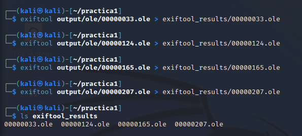
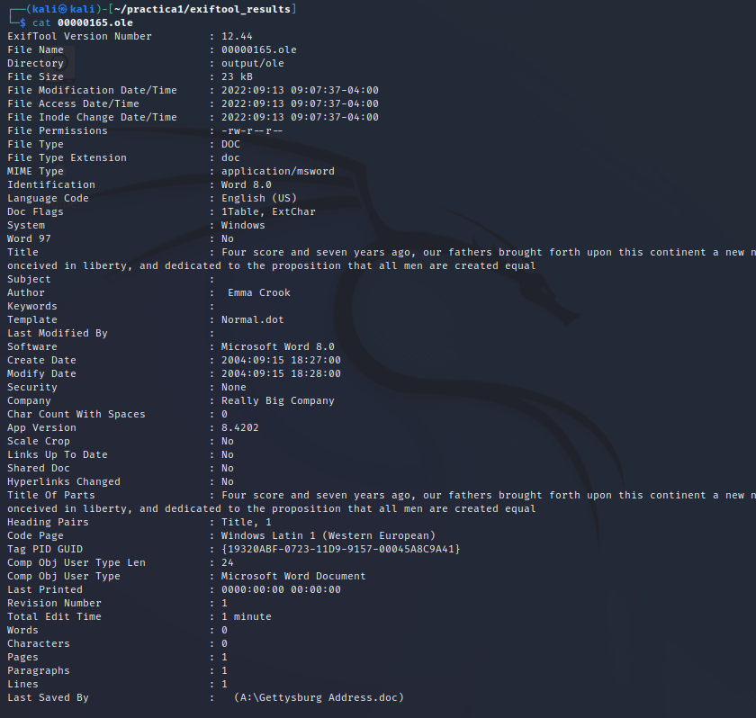
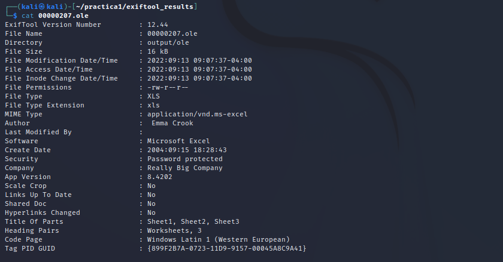

## 13

## Anàlisi amb Foremost i testdisk

#### Des de una màquina Kali/Debian, executa el foremost, torna a carregar la imatge RAW anterior, analitzala i compara els resultats amb els obtinguts anteriorment

Primer de tot he buscat informació de com funciona el foremost ja que no le utilitzat mai i seguidament he aconseguit el seguent:


#### Des de una màquina Kali/Debian, executa el testdisk, torna a carregar la imatge RAW anterior, analitzala i compara els resultats amb els obtinguts anteriorment

lorem


## 14

## Anàlisi amb Exiftool

#### Des de una màquina Kali/Debian, executa Exiftool, carrega els fitxers trobats anteriorment i analitza'ls.

Per veure els resultats els redigirem a tots a una carpeta per tenir-ho tot ben endreçat.



Seguidament les analitzem totes una per una.

El 00000033.ole:  


El 00000124.ole:  


El 00000165.ole:  


El 00000207.ole:  



```
● Què observes en els resultats?
Veiem que els arxius "00000033.ole", el "00000124.ole", i el "00000165.ole" són Microsoft Word, i que el "00000207.ole" és un arxiu Microsoft Excel.

● Hi ha informació interessant?
Com a informació interessant destacar que ens ensenya la data de creació i la data de modificació, el tipus d'arxiu, també el propietari/autor de l'arxiu, el temps que ha estat editant l'arxiu, la companyia a la qual pertany, si està protegida per contrasenya entre altres moltes coses.

```
