# Pràctica 2 - Anàlisi forense II

## 1

## Introducción

#### Eines
```
Windows
Autopsy
Kali Linux
Testdisk (command line)
file, exiftool, rar, https://hexed.it/
```

#### Lliureu un document en format PDF amb els passos que heu seguit i la resposta a les preguntes que es plantejen

## 11

## Escenario

Martino Flores es un conocido ladrón de bancos que logrado apoderarse de más de 1
millón de euros durante su vida de delincuente. Hasta ahora, parece que había actuado
sólo en todos los robos, cosa que hace pensar lo bueno que es este ladrón, ya que la
policía no ha conseguido detenerlo todavía.

Pero, hace una semana, se produjo un atraco en un banco de Barcelona, donde se
llevaron 300.000€. Según varios testigos, el ladrón fue identificado como un hombre
hispano, de 1,80 de estatura aproximadamente y con cuerpo delgado, descripción que
encaja con Martino Flores, pero esta vez no iba sólo, sino que tenía un cómplice que
le ayudó a llevar a cabo ésta misión con éxito.


Los Mossos d’Esquadra, luego de realizar una exhaustiva investigación y siguiendo
pistas que no parecían nada prometedoras, consiguieron dar con el domicilio que usaba
el ladrón para esconderse de los golpes que daba. Aún así, como ya se esperaban,
Martino Flores escapó poco antes de que llegara la policía, llevándose todo el botín y
las pruebas de los delitos consigo. Pero aunque el ladrón se tomó su tiempo para
evitar dejar pistas sobre él o su cómplice, la policía científica encontró un
dispositivo USB guardado en una caja fuerte, cosa que les hizo sospechar que contiene
información importante.

Por ello, han decidido contactar contigo, ya que eres uno de los mejores informáticos
y corre la voz de que puedes extraer datos de cualquier sitio. La policía te ha
entregado una copia bit a bit del dispositivo USB y te ha pedido que averigües que hay
en él, y sobre todo, que les ayudes a responder las preguntas necesarias para resolver
el caso:

```
1. Quién es el nuevo cómplice de Martino Flores?
2. Qué banco será su próximo objetivo y que dia van a efectuar el nuevo golpe?
```
También te han pedido que intentes obtener alguna prueba o evidencia de que Martino
Flores es el famoso ladrón de bancos, ya que por el momento no tienen suficientes
pruebas para meterle en la cárcel a él y a su nuevo cómplice.

[RAW](./RAWs/USB_Marino)

## 12

## Análisis Autopsy Windows

```
Forensics / autopsy
```
Desde una màquina windows, baja e instala l'[Autopsy](https://www.autopsy.com/)

Con este programa, carga la imagen RAW anterior, y analitzala.

```
¿Qué encuentras?
¿Puedes leer alguna información? En caso afirmativo, ¿Cual?
```
## 13

## Análisis testdisk Linux

Desde una màquina Kali/Debian, ejecuta [testdisk](https://www.cgsecurity.org/wiki/TestDisk_Download), vuelve a cargar la imagen RAW anterior, analitzala y compara los resultados.

Primer de tot obrirem la imatge RAW amb el testdisk de la següent manera:  
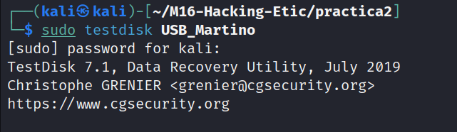

I aconseguim veure que podem recuperar uns quants arxius, ens els baixem per poder treballar-hi.  
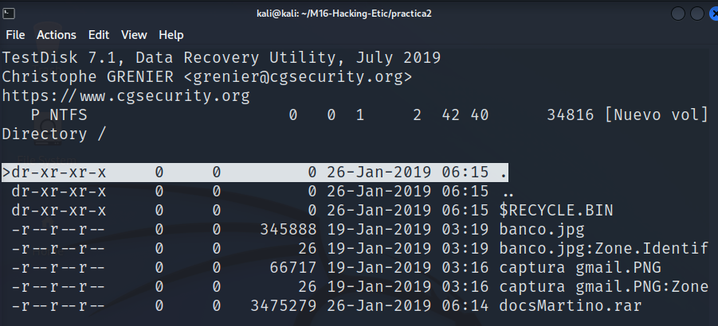  


Veiem que té una captura d'un correu enviat al seu company. El correu va per a un tal "Ricky77@gmail.com".  
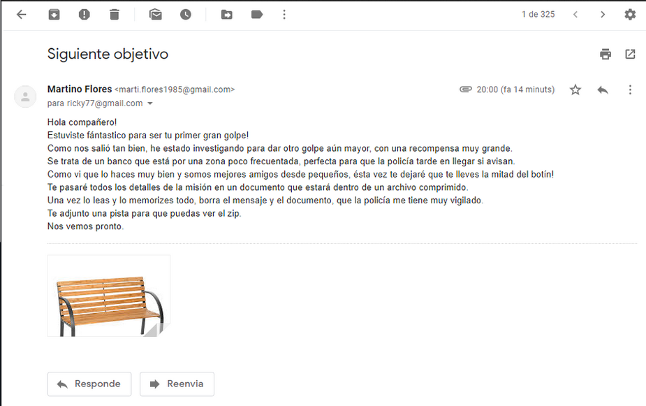

Segons el correu diu que els detalls de la misió són dins el document comprimit. L'intentem descomprimir però veiem que està protegit per una contrasenya.  
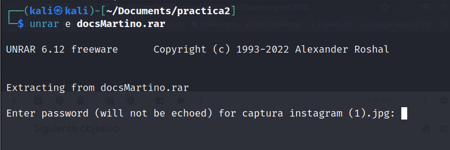

Se suposa que la pista per aconseguir la contrasenya i poder obrir el rar està a la imatge adjuntada anomenada "banco.jpg". Intentarem investigar utilitzant la comanda "hexeditor" del kali que ens ensenyara detalls de la imatge. I després d'una estona investigan me n'adono que hi ha una paraula escrita al final del document, ho provo de contrasenya i efectivament tenim la contrasenya.  
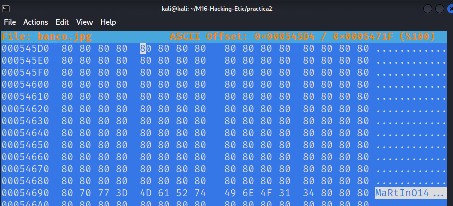

Introduïm la contrasenya i ens descomprimeix diferents arxius.  
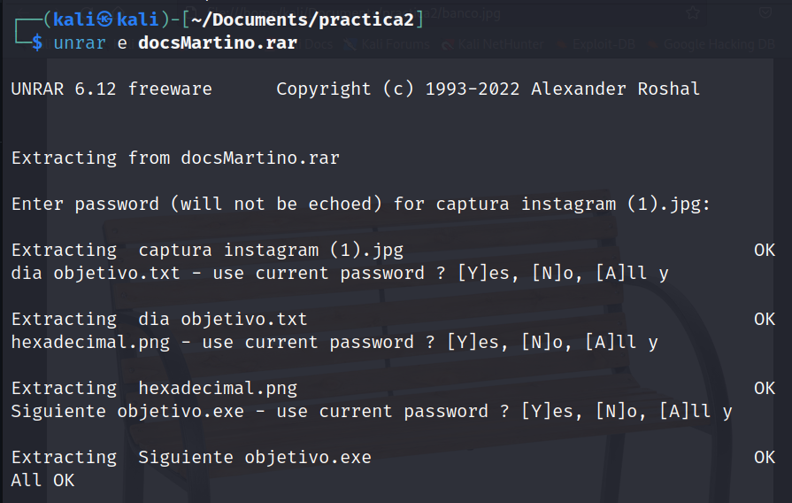

Els posem a una nova carpeta per tenir-ho tot ben ordenat.  
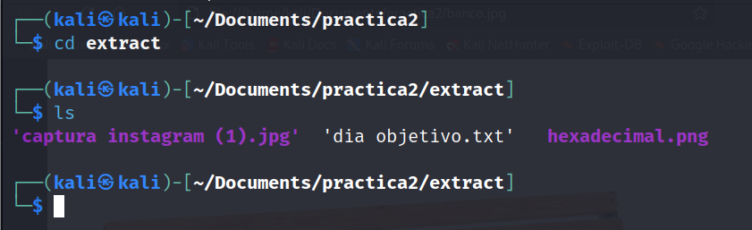

Quan obrim l'arxiu de "dia objetivo" podem veure que hi ha alguna cosa escrita en Morse. Ho pasem per un traductor i obtenim el dia. **29/01/2019**  
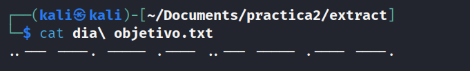  
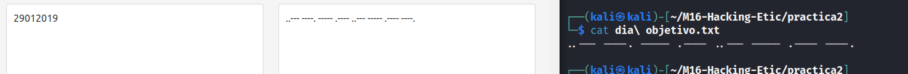

Seguidament intentem obrir les altres dues imatges trobades. La "captura instagram" no la podem obrir.  
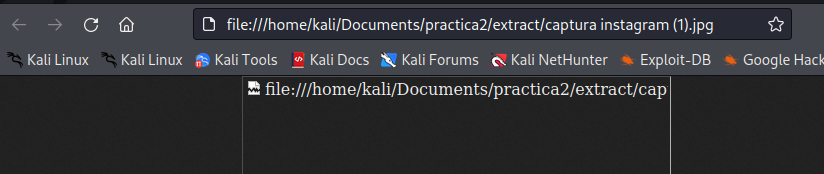

I a l'imatge de "hexadecimal" veiem que hi ha la paraula "JFIF" que és un format d'imatge, aixó em fa pensar que la "captura instagram" se li ha de canviar el format a "JFIF" però no aconsegueixo que funcioni.  
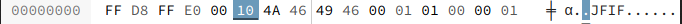  
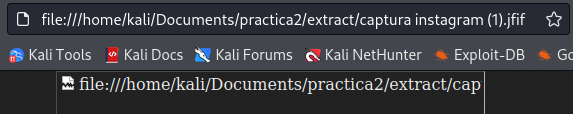

Investigant una mica m'he n'adono que l'imatge "hexadecimal" té el mateix contingut que quan obro la "captura instagram" amb l'editor hexadecimal, però té un numero diferent. El canvio per el mateix que la imatge "hexadecimal".  


Canvïo el numero i obro la imatge.  
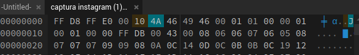  
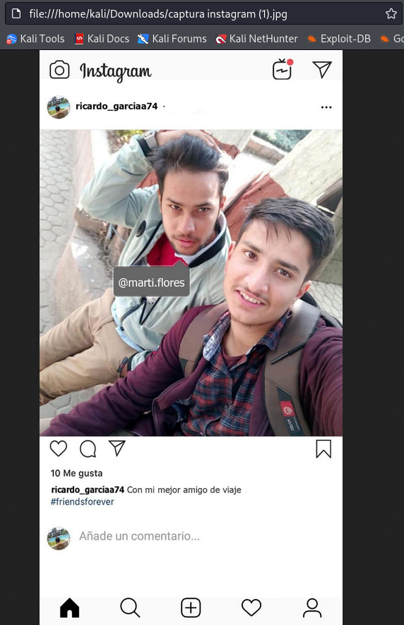


## 14

## Pistas

```
1. En este caso es muy importante fijarse en los pequeños detalles, cualquier cosa
podría ser una evidencia o una pista.
2. Puede ser que haya que pasar alguna fotografía o documento por un editor
hexadecimal.
3. A Martino le gustan los finales felices.
4. Martino Flores tenía pequeños conocimientos de informática y puede haber creado
pruebas falsas o haber modificado algún archivo.
5. A Martino no le gustaba nada usar programas, sólo usaba los esenciales.
6. El cómplice de Martino es un poco más torpe y descuidado que él.
7. Herramientas recomendadas:
```

Autopsy Forensic.
testdisk
[https://hexed.it/](https://hexed.it/)
WinRar


