# Pràctica 3 - Anàlisi forense III

## 1

## Introducción

#### Eines
```
Windows
Autopsy
Kali Linux
Testdisk (command line)
file, exiftool, 7zip...
```

## 11

## Escenario

En una sucursal bancaria alojada en la ciudad de Granada, Miguel Angel Rodríguez Palo
director de dicha sucursal denunció a la policia que habia sido victima de un robo de
datos bancarios y personales debido a que en su cuenta bancaria había desaparecido
todo su dinero y ese dinero fue transferido a otra cuenta fantasma irrastreable. La
policía se puso a investigar su entorno más cercano y el lugar de trabajo del señor
Miguel, y descubrieron que curiosamente había desaparecido también una de las
recepcionistas llamada Brenda, investigando este suceso extraño descubrieron que usó
un dni falso y tampoco podían averiguar quién era, haciendo este hallazgo investigaron
a sus compañeros y declararon que se llevaba últimamente muy bien con uno del
departamento de Contabilidad llamado Roberto Sapo y que también la habían visto
algunas veces conversando con su esposa Marilyn Perez del mismo departamento, pero que
a excepción de estas dos personas era una mujer reservada. Y tomando declaración al
supervisor de “Brenda” declaró que era una mujer trabajadora, que como habían dicho
sus compañeros era reservada salvo esas dos personas mencionadas y que le sorprendió
el manejo y conocimientos que tenía sobre informática, dado que le llevo relativamente
1 dia para entender el funcionamiento de los programas de administración. 

Lo que tenía claro la policía es que quién fuera tuvo que tener ayuda para no ser detectado a
simple vista, así que tuvo que tener algún cómplice, esta conclusión encajaba bastante
bien con el perfil de la sospechosa llamada “Brenda” pero no encontraban la relación
entre una simple recepcionista y el director, cuál era su motivo, y si no fue ella,
quién? La policía requisó el equipo de trabajo que utilizaba “Brenda” para un análisis
profundo y no encontraron nada, pero descubrieron que en la parte trasera de la torre
se encontraba conectado un microUSB que al parecer la habian formateado. Pero tomando
en consideración la declaración de su supervisor ella tenía muchos conocimientos de
informatica, asi que te deja este usb para que lo investigues así que haces una copia
de este mismo con lo que obtienes un fichero [RAW](./RAWs/usbBrenda.raw) con el que averiguarás los secretos
que esconde este incidente...

## 12

## Análisis Autopsy Windows

```
Forensics / autopsy
```
Desde una màquina windows, baja e instala l'[Autopsy](https://www.autopsy.com/)

Con este programa, carga la imagen RAW anterior, y analitzala.
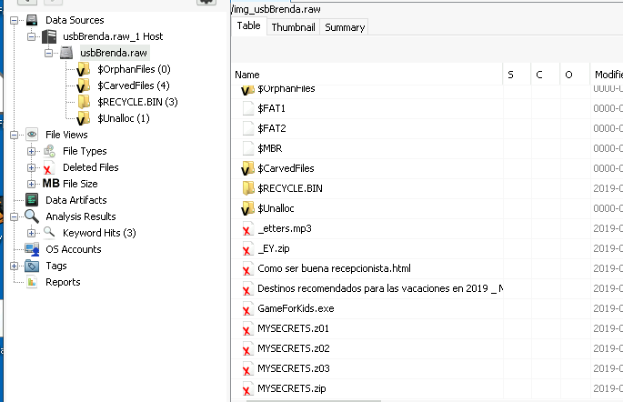

```
¿Qué encuentras?
¿Puedes leer alguna información? En caso afirmativo, ¿Cual?
```
***Es el mateix que amb el kali***
## 13

## Análisis testdisk Linux

Desde una màquina Kali/Debian, ejecuta [testdisk](https://www.cgsecurity.org/wiki/TestDisk_Download), vuelve a cargar la imagen RAW
anterior, analitzala y compara los resultados.

De seguida que executem el testdisk veiem que els arxius estaven borrats però nosaltres els recuparem.  
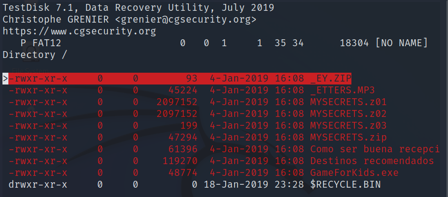

Ens baixem els arxius trobats per poder treballar-hi.  
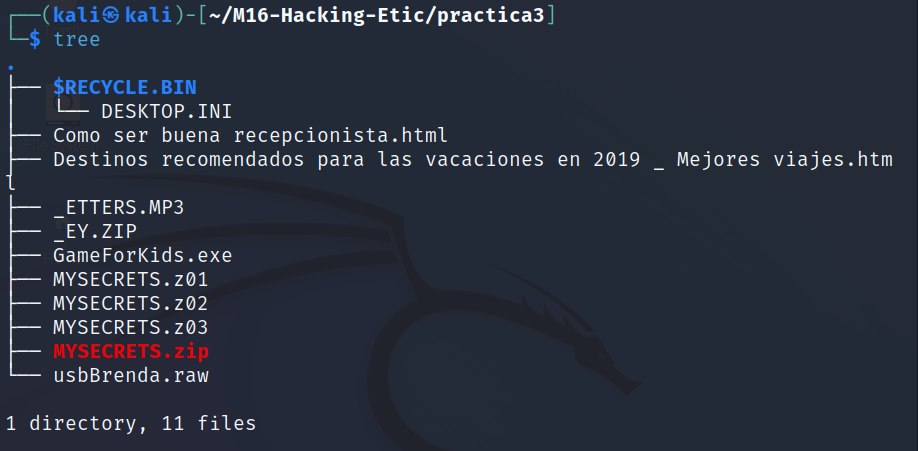

Començarem fent un "file" a tots els arxius per veure si hem de tocar alguna cosa.  
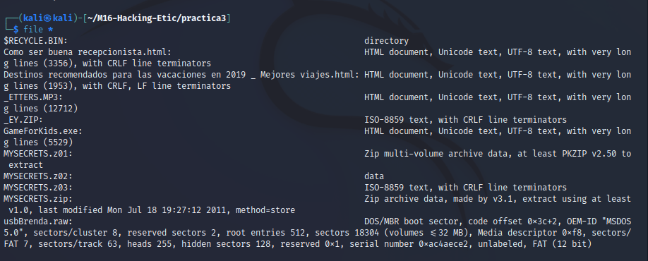

Corregim els arxius que estiguin equivocats per despistar.  
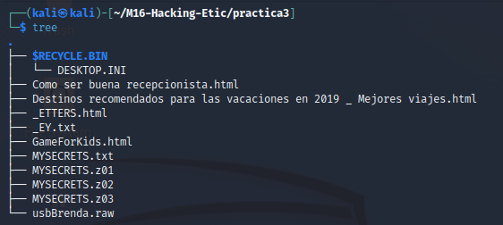

A continuació obrim l'arxiu txt anomenat "EY.txt" on hi podem llegir una contrasenya.  
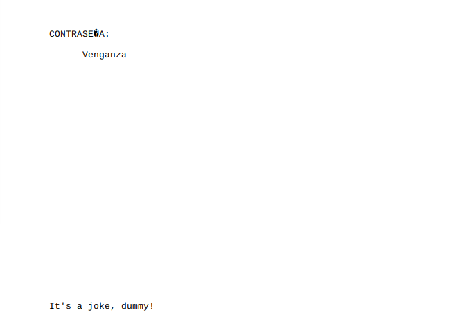

Provem de descomprimir el MYSECTRET.zip amb la contrasenya trobada anteriorment.
Però ens dona una nova carpeta amb més arxius però estan "buits" el que em fa pensar que la contrasenya no era aquesta.  
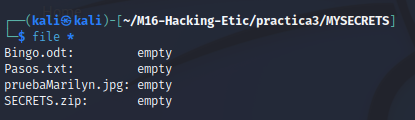

A continuació obrim el MYSECRETS.z03 que en dona un poema.  
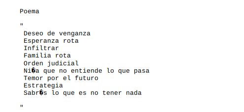

Provo com a constrasenya per el zip les inicials de cada frase (DEIFONTES). I ens dona els seguents arxius.  
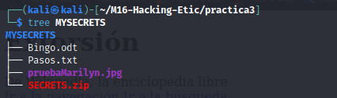

A dins hi ha un arxiu anomenat "Pasos.txt". L'obrim.  
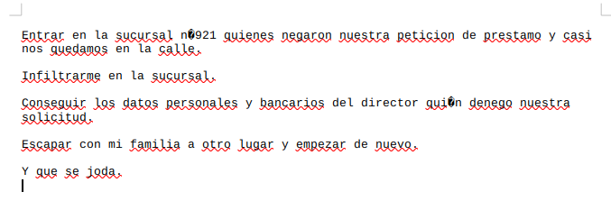

Provo les inicials de les frases (EICEY) com a contrasenya per el zip que hi ha i funciona.  
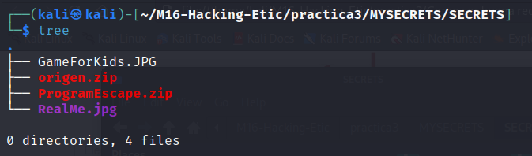

Dins hi ha una imatge que ens dona una contrasenya i varies coses incriminatories.  
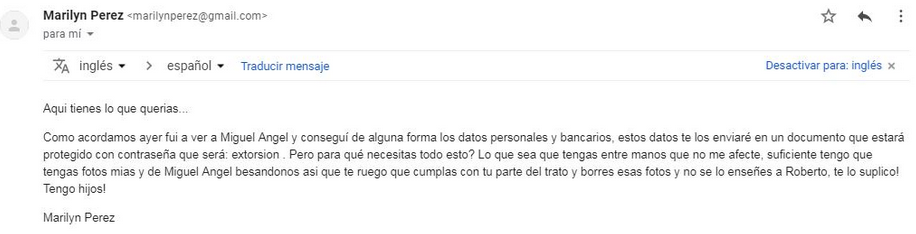

Provo la contrsenya "extorsion" a l'arxiu Bingo.odt. I aconseguim els datos personals del Miguel Angel Rodriguez Palo.  
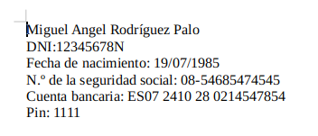

Finalment també trobem una foto del DNI de la "brenda".
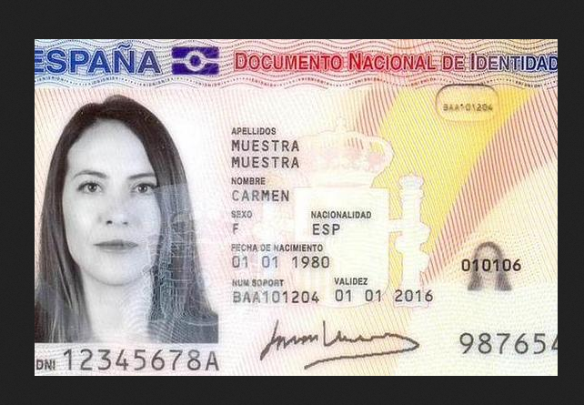


## 14

## Preguntas

```
● Que ha hecho la sospechosa con los archivos encontrados en el usb?  
Ha eliminat els arxius de el usb.  
● Una vez resuelto la pregunta anterior, qué archivos encontraste que puedan tener relación con el incidente?  
Hi ha varis arxius que s'anomenen "MYSECRET" que em fa pensar que són els que tenen més relació amb l'incident.  
● Qué tipo de archivos sospechosos has encontrado? Qué hizo la sospechosa para dificultar su acceso?  
La sospitosa ha canviat els tipus d'arxius per despistar.  
● Qué datos cruciales has podido encontrar para declarar a “Brenda” la culpable?  
He trobat el seu dni juntament amb una foto compromesa i un correu incriminatori.  
● Qué técnica siguió usando la sospechosa para ocultar la contraseña para evitar el acceso directo a los demás archivos comprimidos?Cual era?  
Va utilitzar la tecnica de el acròstics (escriure un codi o contrasenya utilitzant les inicials de les frases).  
● Quién era su cómplice( si lo hubo)? Y porqué lo hizo?  
Marilyn Perez i ho va fer perque estava coaccionada per la "Brenda".  
● Qué esconde el archivo Bingo.odt, cómo supiste la contraseña?
Amaga els datos personals del Miguel Angel. La contrasenya estava escondida en format acròstics.  
● Finalmente cuál es el nombre de “Brenda” y qué motivos tuvo para hacerlo?  
El nom real és Carmen Muestra perque el director li va denegar la seva solicitut de prestam.  
● Actualmente cuál es su paradero?  

```

