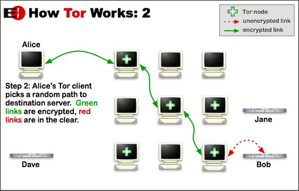

# UF2: Cercant informació

## Red tor

## Index de continguts

1. Proxy
2. VPN
3. Dark web & Deep web
4. Red TOR
5. Webgrafia

## 1

● ¿Qué es un proxy?  

El servidor proxy, és a un programa o dispositiu que fa d'intermediari en les peticions de recursos que realitza un client a un altre servidor.

● Tipos de proxy  

```
cache
inverso
web
transparente
socks
```

## 2
● ¿Qué es una vpn?  

Una xarxa privada virtual és una tecnologia que permet als usuaris enviar i rebre dades a través de xarxes compartides o públiques com si els seus equips informàtics estiguessin connectats directament a la xarxa privada.

Serveix d'intermediari entre el dispositiu i Internet; en configurar i habilitar la VPN tot el trànsit passa a través d'ella, tant enviaments com a recepció de dades.

● Diferencia entre proxy y vpn  

La principal diferencia és que el servidor proxy opera a nivell d'aplicació i només redirigeixen el trànsit d'un programa, mentre que la VPN ho fan per a tot el sistema operatiu i redirigeix el trànsit en la seva totalitat.  


## 3
● ¿Qué es la darkweb y la deepweb?  

La Dark Web és la part de la World Wide Web oculta als motors de cerca que forma part de la Deep Web i que només és accessible mitjançant un navegador especial com TOR.

La Deep Web és el contingut d'Internet que no està indexat pels motors de cerca convencionals.

## 4
● ¿Qué es la red tor?   

Tor és un programari lliure basat en Mozilla Firefox que funciona mitjançant informació xifrada que viatja a través de nodes, en un sistema semblant a les capes d'una ceba. D'aquesta manera, la navegació no és rastrejable i es garanteix la privadesa de qui la utilitzen.

● ¿Cómo funciona la red tor?(indica los pasos desde que entra una petición y se
resuelve)  

La connexió va passant per una sèrie de nodes secrets que xifren les dades que envies i reps.
Les dades surten embolicades en capes de xifratge. En sortir de la ruta, les dades estan en clar.

En arribar al node de sortida, la informació es desxifra perquè arribi al destinatari i puguis ser utilitzada. En aquest moment, les dades perden tota la protecció.  



● ¿Qué es un nodo?  

Un node a Tor és un servidor que es connecta a la xarxa Tor. Qualsevol persona pot configurar un node i connectar-se a la xarxa, cosa que permet que els usuaris de la xarxa Tor enviïn trànsit a través d'aquest. Els nodes s'utilitzen per transmetre el trànsit de manera anònima a través de la xarxa Tor, cosa que significa que no és possible determinar qui està enviant el trànsit o on està dirigit. Hi ha diversos tipus diferents de nodes a la xarxa Tor, incloent nodes d'entrada, nodes de sortida i nodes intermedi. Cada tipus de node té una funció específica a la xarxa i junts ajuden a mantenir la privadesa i la seguretat de la xarxa.
```
entrada
salida
medio
```

● ¿Qué problemas nos puede causar ser dueños de un nodo de salida?  

Ser propietari d'un node de sortida a la xarxa Tor pot tenir alguns riscos i problemes. Per exemple que algunes activitats il·legals poden ser realitzades a través del seu node, cosa que podria posar-lo en risc de ser investigat o perseguit per les autoritats. A més, en ser propietari d'un node de sortida, pot ser més fàcil per als atacants o persones malintencionades fer atacs a través del seu node, cosa que podria posar en risc la seva pròpia seguretat i privadesa.

● ¿Qué seguridad nos da tor?  

La xarxa Tor ofereix una capa addicional de seguretat i privadesa en permetre que el trànsit sigui enrutat de manera anònima a través de diversos nodes i en utilitzar criptografia d'extrem a extrem.

● ¿Qué debemos tener en cuenta para mantener el anonimato en la red tor?  

-- Utilitza sempre la darrera versió del navegador Tor. Això garanteix que tinguis accés a les últimes millores de seguretat i privadesa.

-- No comparteixis informació personal sensible mentre ets a la xarxa Tor. Això inclou informació com el teu nom real, adreça de correu electrònic, adreça de casa, etc.

-- Evita descarregar fitxers grans o realitzar activitats que consumeixin molts recursos mentre ets a la xarxa Tor. Això pot fer que el trànsit sigui més fàcilment detectable.

-- Configura els paràmetres de privadesa al navegador Tor de manera adequada. Això inclou desactivar l'execució de JavaScript i utilitzar extensions de privadesa com HTTPS Everywhere.


● Indica los pasos para conseguir instalar y configurar todo lo necesario en una máquina
ubuntu para navegar tanto desde el root como con nuestro usuario por la red tor.  

1. Obre una terminal i escriu la següent ordre per instal·lar Tor:  
```sudo apt-get install tor```  

2. Un cop instal·lat, inicia el servei de Tor escrivint la següent ordre:    
```sudo service tor start```  

3. A continuació, heu de configurar el vostre navegador perquè utilitzi la xarxa Tor. Podeu utilitzar el navegador Tor Browser, que ja ve configurat per utilitzar la xarxa Tor. Per instal·lar-lo, descarrega l'instal·lador del navegador Tor Browser des del lloc web oficial de Tor.  

4. Un cop instal·lat, inicia el navegador Tor Browser i comença a navegar per la xarxa Tor.  

● Explica como configurar el navegador para navegar por la red tor.  

Si vols navegar per la xarxa Tor utilitzant un altre navegador, com Firefox, has de configurar-lo manualment perquè utilitzi el servidor intermediari de Tor. Per fer-ho, segueix aquests passos:    

1.Obre Firefox i vés a "Opcions" al menú de l'esquerra.  
2.Aneu a "Xarxa" i després a "Configuració del servidor intermediari".  
3.Seleccioneu "Manual" a la llista desplegable "Mètode de configuració del servidor intermediari".  
4.Al camp "Servidor intermediari HTTP", escriu "localhost" i al camp "Port", escriu "9150".  
5.Feu clic a "D'acord" per desar els canvis.  

Ara podeu començar a navegar per la xarxa Tor utilitzant Firefox. Recorda que has de tenir el servei de Tor iniciat a la terminal perquè això funcioni.


