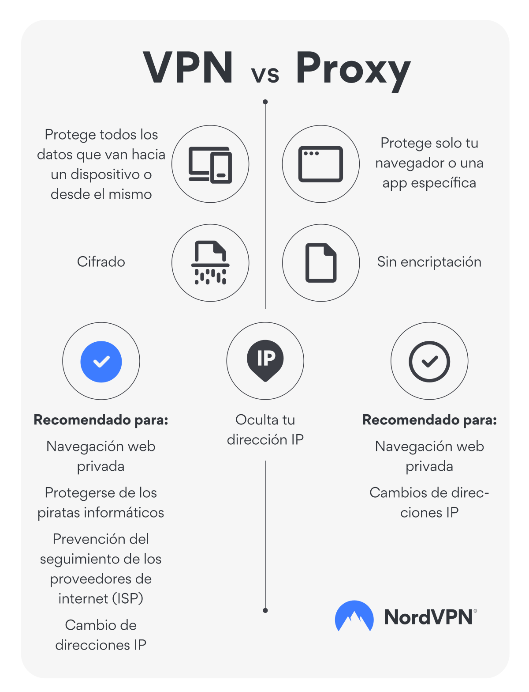

# UF2: Cercant informació

## Red tor

## Index de continguts

1. Proxy
2. VPN
3. Dark web & Deep web
4. Red TOR
5. Webgrafia

## 1

● ¿Qué es un proxy?
El servidor proxy, és a un programa o dispositiu que fa d'intermediari en les peticions de recursos que realitza un client a un altre servidor.

● Tipos de proxy

```
cache
inverso
web
transparente
socks
```

## 2
● ¿Qué es una vpn?
Una xarxa privada virtual és una tecnologia que permet als usuaris enviar i rebre dades a través de xarxes compartides o públiques com si els seus equips informàtics estiguessin connectats directament a la xarxa privada.

Serveix d'intermediari entre el dispositiu i Internet; en configurar i habilitar la VPN tot el trànsit passa a través d'ella, tant enviaments com a recepció de dades.

● Diferencia entre proxy y vpn
La principal diferencia és que el servidor proxy opera a nivell d'aplicació i només redirigeixen el trànsit d'un programa, mentre que la VPN ho fan per a tot el sistema operatiu i redirigeix el trànsit en la seva totalitat.
  


## 3
● ¿Qué es la darkweb y la deepweb?

## 4
● ¿Qué es la red tor?

● ¿Cómo funciona la red tor?(indica los pasos desde que entra una petición y se
resuelve)

● ¿Qué es un nodo?

```
entrada
salida
medio
```

● ¿Qué problemas nos puede causar ser dueños de un nodo de salida?

● ¿Qué seguridad nos da tor?

● ¿Qué debemos tener en cuenta para mantener el anonimato en la red tor?


Indica los pasos para conseguir instalar y configurar todo lo necesario en una máquina
ubuntu para navegar tanto desde el root como con nuestro usuario por la red tor.

Explica como configurar el navegador para navegar por la red tor.

